```python
import pandas as pd
df=pd.read_csv('real_estate_data.csv', sep='\t')
print(df.head())
```

       total_images  last_price  total_area first_day_exposition  rooms  \
    0            20  13000000.0       108.0  2019-03-07T00:00:00      3   
    1             7   3350000.0        40.4  2018-12-04T00:00:00      1   
    2            10   5196000.0        56.0  2015-08-20T00:00:00      2   
    3             0  64900000.0       159.0  2015-07-24T00:00:00      3   
    4             2  10000000.0       100.0  2018-06-19T00:00:00      2   
    
       ceiling_height  floors_total  living_area  floor is_apartment  ...  \
    0            2.70          16.0         51.0      8          NaN  ...   
    1             NaN          11.0         18.6      1          NaN  ...   
    2             NaN           5.0         34.3      4          NaN  ...   
    3             NaN          14.0          NaN      9          NaN  ...   
    4            3.03          14.0         32.0     13          NaN  ...   
    
       kitchen_area  balcony    locality_name  airports_nearest  \
    0          25.0      NaN  Санкт-Петербург           18863.0   
    1          11.0      2.0   посёлок Шушары           12817.0   
    2           8.3      0.0  Санкт-Петербург           21741.0   
    3           NaN      0.0  Санкт-Петербург           28098.0   
    4          41.0      NaN  Санкт-Петербург           31856.0   
    
      cityCenters_nearest  parks_around3000  parks_nearest  ponds_around3000  \
    0             16028.0               1.0          482.0               2.0   
    1             18603.0               0.0            NaN               0.0   
    2             13933.0               1.0           90.0               2.0   
    3              6800.0               2.0           84.0               3.0   
    4              8098.0               2.0          112.0               1.0   
    
       ponds_nearest  days_exposition  
    0          755.0              NaN  
    1            NaN             81.0  
    2          574.0            558.0  
    3          234.0            424.0  
    4           48.0            121.0  
    
    [5 rows x 22 columns]
    


Заполните пропуски, где это уместно. Опишите, почему вы решили заполнить пропуски именно в этих столбцах и как выбрали значения.
Укажите причины, которые могли привести к пропускам в данных.
Приведите данные к нужным типам:
Поясните, в каких столбцах нужно изменить тип данных и почему.
___________________________________________________________________________________________________________________________

Сначала заменила значения Nan в столбце балконы на 0-так как этих балконов нет.
Потеря данных технологическая -неправильный выгруз и человеческий фактор-неправильно внесенные данные.

некорректные значения меняем на нан


```python
print(df['balcony'].value_counts())
df['balcony']=df['balcony'].fillna('0')
```

    1.0    4195
    0.0    3758
    2.0    3659
    5.0     304
    4.0     183
    3.0      81
    Name: balcony, dtype: int64
    


```python
df['last_price']=df['last_price'].astype('int')
df['total_area']=df['total_area'].astype('int')

df['locality_name']=df['locality_name'].str.lower()

print(df['is_apartment'].value_counts())

print(df.head())
df.info()

```

    False    2725
    True       50
    Name: is_apartment, dtype: int64
       total_images  last_price  total_area first_day_exposition  rooms  \
    0            20    13000000         108  2019-03-07T00:00:00      3   
    1             7     3350000          40  2018-12-04T00:00:00      1   
    2            10     5196000          56  2015-08-20T00:00:00      2   
    3             0    64900000         159  2015-07-24T00:00:00      3   
    4             2    10000000         100  2018-06-19T00:00:00      2   
    
       ceiling_height  floors_total  living_area  floor is_apartment  ...  \
    0            2.70          16.0         51.0      8          NaN  ...   
    1             NaN          11.0         18.6      1          NaN  ...   
    2             NaN           5.0         34.3      4          NaN  ...   
    3             NaN          14.0          NaN      9          NaN  ...   
    4            3.03          14.0         32.0     13          NaN  ...   
    
       kitchen_area  balcony    locality_name airports_nearest  \
    0          25.0        0  санкт-петербург          18863.0   
    1          11.0      2.0   посёлок шушары          12817.0   
    2           8.3      0.0  санкт-петербург          21741.0   
    3           NaN      0.0  санкт-петербург          28098.0   
    4          41.0        0  санкт-петербург          31856.0   
    
      cityCenters_nearest  parks_around3000  parks_nearest  ponds_around3000  \
    0             16028.0               1.0          482.0               2.0   
    1             18603.0               0.0            NaN               0.0   
    2             13933.0               1.0           90.0               2.0   
    3              6800.0               2.0           84.0               3.0   
    4              8098.0               2.0          112.0               1.0   
    
       ponds_nearest  days_exposition  
    0          755.0              NaN  
    1            NaN             81.0  
    2          574.0            558.0  
    3          234.0            424.0  
    4           48.0            121.0  
    
    [5 rows x 22 columns]
    <class 'pandas.core.frame.DataFrame'>
    RangeIndex: 23699 entries, 0 to 23698
    Data columns (total 22 columns):
     #   Column                Non-Null Count  Dtype  
    ---  ------                --------------  -----  
     0   total_images          23699 non-null  int64  
     1   last_price            23699 non-null  int32  
     2   total_area            23699 non-null  int32  
     3   first_day_exposition  23699 non-null  object 
     4   rooms                 23699 non-null  int64  
     5   ceiling_height        14504 non-null  float64
     6   floors_total          23613 non-null  float64
     7   living_area           21796 non-null  float64
     8   floor                 23699 non-null  int64  
     9   is_apartment          2775 non-null   object 
     10  studio                23699 non-null  bool   
     11  open_plan             23699 non-null  bool   
     12  kitchen_area          21421 non-null  float64
     13  balcony               23699 non-null  object 
     14  locality_name         23650 non-null  object 
     15  airports_nearest      18157 non-null  float64
     16  cityCenters_nearest   18180 non-null  float64
     17  parks_around3000      18181 non-null  float64
     18  parks_nearest         8079 non-null   float64
     19  ponds_around3000      18181 non-null  float64
     20  ponds_nearest         9110 non-null   float64
     21  days_exposition       20518 non-null  float64
    dtypes: bool(2), float64(11), int32(2), int64(3), object(4)
    memory usage: 3.1+ MB
    

Вывела таблицу инфо-чтобы посмотреть какие данные отсутвуют. Методом филлна заполнила данные Nan средним или медианным значениями. Определяла так-если по бокам скопление крупных а потом мелких значений-медиана-так есть вбросы. Если данные вразнобой-среднее. Опять таблица инфо-для проверки.


```python
age_ceiling_height=df['ceiling_height'].mean()
df['ceiling_height']=df['ceiling_height'].fillna(age_ceiling_height)

age_floors_total=df['floors_total'].median()
df['floors_total']=df['floors_total'].fillna(age_floors_total)


age_living_area=df['living_area'].mean()
df['living_area']=df['living_area'].fillna(age_ceiling_height)


age_airports_nearest=df['airports_nearest'].mean()
df['airports_nearest']=df['airports_nearest'].fillna(age_airports_nearest)


age_cityCenters_nearest=df['cityCenters_nearest'].median()
df['cityCenters_nearest']=df['cityCenters_nearest'].fillna(age_cityCenters_nearest)


age_parks_around3000 =df['parks_around3000'].mean()
df['parks_around3000']=df['parks_around3000'].fillna(age_parks_around3000 )                                                 
 

age_parks_nearest=df['parks_nearest'].median()
df['parks_nearest']=df['parks_nearest'].fillna(age_parks_nearest)


age_ponds_around3000 =df['ponds_around3000'].mean()
df['ponds_around3000']=df['ponds_around3000'].fillna(age_ponds_around3000)    
   

age_ponds_nearest=df['ponds_nearest'].median()
df['ponds_nearest']=df['ponds_nearest'].fillna(age_ponds_nearest)

age_days_exposition =df['days_exposition'].median()
df['days_exposition']=df['days_exposition'].fillna(age_days_exposition)

age_kitchen_area = df['kitchen_area'].median()
df['kitchen_area'] = df['kitchen_area'].fillna(age_kitchen_area)


df['locality_name']=df['locality_name'].fillna('')
df['is_apartment']=df['is_apartment'].fillna('')  
    
print(df.head())
df.info()
```

       total_images  last_price  total_area first_day_exposition  rooms  \
    0            20    13000000         108  2019-03-07T00:00:00      3   
    1             7     3350000          40  2018-12-04T00:00:00      1   
    2            10     5196000          56  2015-08-20T00:00:00      2   
    3             0    64900000         159  2015-07-24T00:00:00      3   
    4             2    10000000         100  2018-06-19T00:00:00      2   
    
       ceiling_height  floors_total  living_area  floor is_apartment  ...  \
    0        2.700000          16.0    51.000000      8               ...   
    1        2.771499          11.0    18.600000      1               ...   
    2        2.771499           5.0    34.300000      4               ...   
    3        2.771499          14.0     2.771499      9               ...   
    4        3.030000          14.0    32.000000     13               ...   
    
       kitchen_area  balcony    locality_name airports_nearest  \
    0          25.0        0  санкт-петербург          18863.0   
    1          11.0      2.0   посёлок шушары          12817.0   
    2           8.3      0.0  санкт-петербург          21741.0   
    3           9.1      0.0  санкт-петербург          28098.0   
    4          41.0        0  санкт-петербург          31856.0   
    
      cityCenters_nearest  parks_around3000  parks_nearest  ponds_around3000  \
    0             16028.0               1.0          482.0               2.0   
    1             18603.0               0.0          455.0               0.0   
    2             13933.0               1.0           90.0               2.0   
    3              6800.0               2.0           84.0               3.0   
    4              8098.0               2.0          112.0               1.0   
    
       ponds_nearest  days_exposition  
    0          755.0             95.0  
    1          502.0             81.0  
    2          574.0            558.0  
    3          234.0            424.0  
    4           48.0            121.0  
    
    [5 rows x 22 columns]
    <class 'pandas.core.frame.DataFrame'>
    RangeIndex: 23699 entries, 0 to 23698
    Data columns (total 22 columns):
     #   Column                Non-Null Count  Dtype  
    ---  ------                --------------  -----  
     0   total_images          23699 non-null  int64  
     1   last_price            23699 non-null  int32  
     2   total_area            23699 non-null  int32  
     3   first_day_exposition  23699 non-null  object 
     4   rooms                 23699 non-null  int64  
     5   ceiling_height        23699 non-null  float64
     6   floors_total          23699 non-null  float64
     7   living_area           23699 non-null  float64
     8   floor                 23699 non-null  int64  
     9   is_apartment          23699 non-null  object 
     10  studio                23699 non-null  bool   
     11  open_plan             23699 non-null  bool   
     12  kitchen_area          23699 non-null  float64
     13  balcony               23699 non-null  object 
     14  locality_name         23699 non-null  object 
     15  airports_nearest      23699 non-null  float64
     16  cityCenters_nearest   23699 non-null  float64
     17  parks_around3000      23699 non-null  float64
     18  parks_nearest         23699 non-null  float64
     19  ponds_around3000      23699 non-null  float64
     20  ponds_nearest         23699 non-null  float64
     21  days_exposition       23699 non-null  float64
    dtypes: bool(2), float64(11), int32(2), int64(3), object(4)
    memory usage: 3.1+ MB
    

Шаг 3. Посчитайте и добавьте в таблицу:

день недели, месяц и год публикации объявления - day, year, month

цену квадратного метра- price_metr

этаж квартиры - floor_category

соотношение жилой и общей площади - zilaya_plosad

отношение площади кухни к общей - kuhna_plosad


```python
print(df['first_day_exposition'].head())

df['first_day_exposition']=pd.to_datetime(df['first_day_exposition'])

df['day']= df['first_day_exposition'].dt.day
df['year']= df['first_day_exposition'].dt.year
df['month']= df['first_day_exposition'].dt.month
dw_mapping={
    0: 'Monday', 
    1: 'Tuesday', 
    2: 'Wednesday', 
    3: 'Thursday', 
    4: 'Friday',
    5: 'Saturday', 
    6: 'Sunday'
} 
df['day']=df['first_day_exposition'].dt.weekday.map(dw_mapping)
print(df.head())


def price(XXX):
    price_metr=XXX['last_price']/XXX['total_area']
    return price_metr
df['price_metr']=df.apply(price, axis=1)

df['price_metr']=df['price_metr'].astype('int')
print(df['price_metr'].head())


def floorsss(YYY):
    if YYY['floor']==1:
        return 'первый'
    elif YYY['floors_total']=='floors_total':
        return 'последний'
    else:
        return 'другой'
df['floor_category']=df.apply(floorsss, axis=1)
print(df['floor_category'].head())


def poleznaya(CCC):
    zilaya_plosad=CCC['living_area']/CCC['total_area']
    return zilaya_plosad
df['zilaya_plosad']=df.apply(poleznaya, axis=1)
print(df['zilaya_plosad'].head())


def kuhna(DDD):
    kuhna_plosad=DDD['kitchen_area']/DDD['total_area']
    return kuhna_plosad
df['kuhna_plosad']=df.apply(kuhna, axis=1)
print(df['kuhna_plosad'].head())


```

    0   2019-03-07
    1   2018-12-04
    2   2015-08-20
    3   2015-07-24
    4   2018-06-19
    Name: first_day_exposition, dtype: datetime64[ns]
       total_images  last_price  total_area first_day_exposition  rooms  \
    0            20    13000000         108           2019-03-07      3   
    1             7     3350000          40           2018-12-04      1   
    2            10     5196000          56           2015-08-20      2   
    3             0    64900000         159           2015-07-24      3   
    4             2    10000000         100           2018-06-19      2   
    
       ceiling_height  floors_total  living_area  floor is_apartment  ...  \
    0        2.700000          16.0    51.000000      8               ...   
    1        2.771499          11.0    18.600000      1               ...   
    2        2.771499           5.0    34.300000      4               ...   
    3        2.771499          14.0     2.771499      9               ...   
    4        3.030000          14.0    32.000000     13               ...   
    
       ponds_around3000  ponds_nearest  days_exposition       day  year  month  \
    0               2.0          755.0             95.0  Thursday  2019      3   
    1               0.0          502.0             81.0   Tuesday  2018     12   
    2               2.0          574.0            558.0  Thursday  2015      8   
    3               3.0          234.0            424.0    Friday  2015      7   
    4               1.0           48.0            121.0   Tuesday  2018      6   
    
       price_metr  floor_category  zilaya_plosad  kuhna_plosad  
    0      120370          другой       0.472222      0.231481  
    1       83750          первый       0.465000      0.275000  
    2       92785          другой       0.612500      0.148214  
    3      408176          другой       0.017431      0.057233  
    4      100000          другой       0.320000      0.410000  
    
    [5 rows x 29 columns]
    0    120370
    1     83750
    2     92785
    3    408176
    4    100000
    Name: price_metr, dtype: int32
    0    другой
    1    первый
    2    другой
    3    другой
    4    другой
    Name: floor_category, dtype: object
    0    0.472222
    1    0.465000
    2    0.612500
    3    0.017431
    4    0.320000
    Name: zilaya_plosad, dtype: float64
    0    0.231481
    1    0.275000
    2    0.148214
    3    0.057233
    4    0.410000
    Name: kuhna_plosad, dtype: float64
    

Шаг 4. Проведите исследовательский анализ данных и выполните инструкции:

Изучите следующие параметры: площадь, цена, число комнат, высота потолков. Постройте гистограммы для каждого параметра.

total_area -— площадь квартиры в квадратных метрах (м²)
price_metr - цена 1 кв.м
rooms - число комнат
ceiling_height - высота потолков
____________________________________________________________________________________________________________________
1.Когда мы изучаем какой то параметр-мы сначала находим его уникальные значения и как часто они появляются value_counts().
По оси ординат-будет количество , а по оси абсцисс-значения. График-гистрограмма-метод .hist()
Для каждого значения найдем уникальные значения и их количества чтобы гистрограмма была информативная и мы видели максимальные значения столбцов.
По графику видно что больше 2-х комнатных и 3-х комнатных квартир. Самые высокие потолки в 2-х комнатных квартирах.
То есть по вертикальной прямой стоит количество, а по оси х-значения.
Методом дискрайб посмотрели описание-вбросов нет-медиана и среднее одинаковые.


```python
print(df['rooms'].value_counts().head())
print(df['ceiling_height'].value_counts().head())

df['rooms'].hist(range=(0,10), bins=10)
df['ceiling_height'].hist(range=(0,10), bins=10)

```

    1    8047
    2    7940
    3    5814
    4    1180
    5     326
    Name: rooms, dtype: int64
    2.771499    9195
    2.500000    3515
    2.600000    1646
    2.700000    1574
    3.000000    1112
    Name: ceiling_height, dtype: int64
    


    <AxesSubplot:>


    
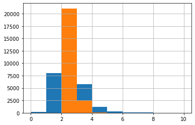
    


Размер квартир чаще 43-45 метров.


```python
print(df['total_area'].value_counts().head())
df['total_area'].hist(range=(0,100), bins=100)

```

    45    763
    44    697
    42    657
    31    645
    35    569
    Name: total_area, dtype: int64
    


    <AxesSubplot:>


    
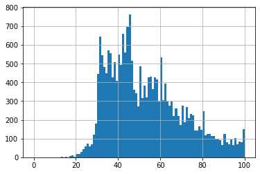
    


Цена квадратного метра-'price_metr'


```python
print(df['price_metr'].value_counts().head())
df['price_metr'].hist(bins=100)
df['price_metr'].describe()
```

    100000    445
    83333      97
    75000      86
    90000      85
    80000      81
    Name: price_metr, dtype: int64
    


    count    2.369900e+04
    mean     9.987371e+04
    std      5.041842e+04
    min      1.110000e+02
    25%      7.698500e+04
    50%      9.545400e+04
    75%      1.148640e+05
    max      1.907500e+06
    Name: price_metr, dtype: float64


    
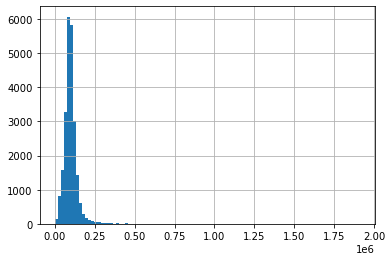
    


4.Изучите время продажи квартиры. Постройте гистограмму. Посчитайте среднее и медиану. Опишите, сколько обычно занимает продажа. Когда можно считать, что продажи прошли очень быстро, а когда необычно долго? - — сколько дней было размещено объявление (от публикации до снятия)

Изучите время продажи квартиры. Постройте гистограмму. Посчитайте среднее и медиану. Опишите, сколько обычно занимает продажа. Когда можно считать, что продажи прошли очень быстро, а когда необычно долго.

По гистограмме видно что есть вбросы. Это же видно по методу дискрайб. Поэтому за настоящее значение-берем медианну-а не среднее. Обычно  продается 95 дней. Среднее значение-mean-169- в 2 раза практически больше - median-95- это значит есть хвосты со значениями.Короче значения меньше 95 дней-быстро продаются, а больше медианны 95 дней-медленно. 
Изучили-есть вбросы. Увидели их и подсчетом медиана и среднего и методом дискрайб и графиком.


```python
print(df['days_exposition'].value_counts().head(10))

df['days_exposition'].hist(range=(0,100), bins=100)

days_exposition_avg=df['days_exposition'].mean()
print(days_exposition_avg)
days_exposition_mediana=df['days_exposition'].median()
print(days_exposition_mediana)

df['days_exposition'].describe()
```

    95.0    3245
    45.0     880
    60.0     538
    7.0      234
    30.0     208
    90.0     204
    4.0      176
    3.0      158
    5.0      152
    14.0     148
    Name: days_exposition, dtype: int64
    169.36022616988058
    95.0
    


    count    23699.000000
    mean       169.360226
    std        206.535633
    min          1.000000
    25%         45.000000
    50%         95.000000
    75%        199.000000
    max       1580.000000
    Name: days_exposition, dtype: float64


    
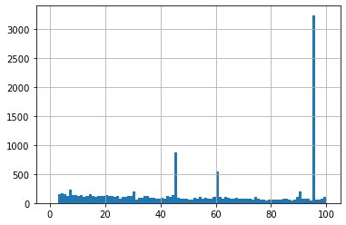
    


Шаг 4. Проведите исследовательский анализ данных и выполните инструкции:

Уберите редкие и выбивающиеся значения. Опишите, какие особенности обнаружили.
Какие факторы больше всего влияют на стоимость квартиры? Изучите, зависит ли цена от площади, числа комнат, удалённости от центра. Изучите зависимость цены от того, на каком этаже расположена квартира: первом, последнем или другом. Также изучите зависимость от даты размещения: дня недели, месяца и года.

---------------------------------------------------------------------------------------------------------------------------

Отфильтруем время продаж квартир - days_exposition- методом .query. Метод отсечения-для получения нужного среза-применяется ко всей таблице - df. Таким образом убрали вбросы.

Зависит на каком  этаже-последние-выше цена.

Цена квадратного метра не зависит от квадратуры квартиры. Слабо зависит цена 1 кв.м. от квадратуры жилой площади в квартире.

Цена зависит от месяца продажи-в летние месяца-когда люди тратят деньги на отдых-цена квартир ниже.
На декабрь и январь-цена ниже-возможно люди ждут ставки по ипотеке-более выгодные.

День недели-суббота и воскресенье-дешевле-выходные.

С каждым годом недвижимость дешевеет. Еще немного и квадратный метр  в России будет стоить как картошка на базаре. 

От удаленности от центра -зависит. В Питере цена выше чем в деревнях и населеных пунктах.


```python
df_novaya=df.query('days_exposition <= days_exposition.median()')

print(df_novaya.sort_values(by='price_metr',ascending=False).head(10))

df_novaya_floor=df_novaya.pivot_table(index='floor_category', values='price_metr')
print(df_novaya_floor.head())

df_total_area=df_novaya.pivot_table(index='total_area', values='price_metr')
print(df_total_area.head())
df_living_area=df_novaya.pivot_table(index='living_area', values='price_metr')
print(df_living_area.head(10))

df_day=df_novaya.pivot_table(index='day', values='price_metr')
df_year=df_novaya.pivot_table(index='year', values='price_metr')
df_month=df_novaya.pivot_table(index='month', values='price_metr')
print(df_day.head(12))
print(df_year.head(12))
print(df_month.head(12))

df_city=df_novaya.pivot_table(index='cityCenters_nearest', values='price_metr')
print(df_city.head(10))

```

           total_images  last_price  total_area first_day_exposition  rooms  \
    12971            19   763000000         400           2017-09-30      7   
    22831            18   289238400         187           2019-03-19      2   
    4996             20   124000000         124           2017-10-12      4   
    4859             16    28000000          33           2019-04-29      1   
    17172            14    28000000          33           2019-04-30      1   
    17912            17   135000000         166           2019-02-07      3   
    8322             20    39900000          55           2017-10-26      1   
    19155            20   160000000         243           2018-11-12      5   
    21238             1    24412900          38           2018-06-27      1   
    16590            10    98000000         155           2017-12-16      3   
    
           ceiling_height  floors_total  living_area  floor is_apartment  ...  \
    12971        2.771499          10.0   250.000000     10               ...   
    22831        3.370000           6.0    63.700000      6               ...   
    4996         3.000000           4.0    67.200000      2        False  ...   
    4859         3.500000           5.0     2.771499      2               ...   
    17172        3.500000           5.0     2.771499      2               ...   
    17912        3.300000           7.0    52.000000      1               ...   
    8322         3.050000           6.0    35.000000      4               ...   
    19155        2.771499           5.0   145.000000      4               ...   
    21238        2.771499          10.0    16.830000      4        False  ...   
    16590        2.771499           8.0     2.771499      6               ...   
    
           ponds_around3000  ponds_nearest  days_exposition        day  year  \
    12971          3.000000          756.0             33.0   Saturday  2017   
    22831          3.000000          188.0             95.0    Tuesday  2019   
    4996           3.000000          172.0             45.0   Thursday  2017   
    4859           3.000000          119.0             95.0     Monday  2019   
    17172          3.000000           27.0             95.0    Tuesday  2019   
    17912          3.000000          215.0             95.0   Thursday  2019   
    8322           3.000000          202.0             95.0   Thursday  2017   
    19155          1.000000          200.0             18.0     Monday  2018   
    21238          0.770255          502.0             44.0  Wednesday  2018   
    16590          2.000000          198.0             90.0   Saturday  2017   
    
           month  price_metr  floor_category  zilaya_plosad  kuhna_plosad  
    12971      9     1907500          другой       0.625000      0.022750  
    22831      3     1546729          другой       0.340642      0.161497  
    4996      10     1000000          другой       0.541935      0.161290  
    4859       4      848484          другой       0.083985      0.275758  
    17172      4      848484          другой       0.083985      0.275758  
    17912      2      813253          первый       0.313253      0.385542  
    8322      10      725454          другой       0.636364      0.145455  
    19155     11      658436          другой       0.596708      0.135802  
    21238      6      642444          другой       0.442895      0.281579  
    16590     12      632258          другой       0.017881      0.058710  
    
    [10 rows x 29 columns]
                       price_metr
    floor_category               
    другой          102230.274256
    первый           84281.898261
                   price_metr
    total_area               
    13          188102.000000
    14           85000.000000
    15          131110.666667
    16          131250.000000
    17          105690.750000
                    price_metr
    living_area               
    2.000000     111709.500000
    2.771499      96855.043732
    5.000000     121818.000000
    5.400000      79220.000000
    6.500000     122727.000000
    8.000000     178000.000000
    8.300000     190476.000000
    8.500000     117142.000000
    9.000000     148860.750000
    9.800000     115217.000000
                  price_metr
    day                     
    Friday     100070.823712
    Monday     100336.200871
    Saturday    98707.581900
    Sunday      99569.987267
    Thursday   100820.847443
    Tuesday     99978.366374
    Wednesday  100549.385894
             price_metr
    year               
    2014  153185.500000
    2015  138239.657143
    2016  100212.930269
    2017   96952.234413
    2018   97986.714952
    2019  107835.688330
              price_metr
    month               
    1       98995.116122
    2      100407.105982
    3      101981.691857
    4      103952.808853
    5       98385.523894
    6       95883.050971
    7       98500.939720
    8      101104.182540
    9      100609.632579
    10      97992.212605
    11     100752.290236
    12      98459.512360
                         price_metr
    cityCenters_nearest            
    181.0                  195591.0
    287.0                   88796.0
    291.0                  101769.0
    318.0                  454282.8
    329.0                  100000.0
    376.0                  137755.0
    387.0                  140625.0
    399.0                   90000.0
    410.0                   75471.0
    423.0                  188888.0
    

Выберите 10 населённых пунктов с наибольшим числом объявлений. Посчитайте среднюю цену квадратного метра в этих населённых пунктах. Выделите среди них населённые пункты с самой высокой и низкой стоимостью жилья. Эти данные можно найти по имени в столбце locality_name.

-----------------------------------------------------------------------------------------------------------------------------
Сначала отсортировали таблицу-чтобы посмотреть максимальную и минимальную величину-это 30-50.
Потом сделали срез по этим параметрам.
Потом методом .pivot_table-посмотрели зависимость 2-х величин.


```python

print(df_novaya.sort_values('total_images', ascending=False).head(10))
df_reklama=df.query('total_images>=30 and total_images<=50')
df_reklama_pivot=df_reklama.pivot_table(index="locality_name", values='price_metr')
print(df_reklama_pivot.head(15))

```

           total_images  last_price  total_area first_day_exposition  rooms  \
    9778             50    11000000          87           2017-10-25      2   
    12667            50    20500000          76           2017-12-10      3   
    21199            37    11500000          65           2018-02-01      2   
    308              35     5700000          83           2018-02-01      3   
    10523            35    17000000          90           2017-11-10      3   
    21076            32     8300000          84           2017-11-11      3   
    22517            31     9000000          82           2018-02-22      3   
    5349             31    11990000          92           2017-12-07      3   
    3455             30     3570000          38           2017-11-10      1   
    20280            30     8800000          97           2017-10-05      3   
    
           ceiling_height  floors_total  living_area  floor is_apartment  ...  \
    9778         2.771499          25.0         32.5     11               ...   
    12667        2.771499          20.0         47.0     16               ...   
    21199        2.771499          25.0         23.0     10               ...   
    308          2.600000           5.0         51.8      2               ...   
    10523        2.771499          16.0         52.0      6               ...   
    21076        2.771499          14.0         49.9      3               ...   
    22517        3.000000           5.0         52.7      5               ...   
    5349         2.771499          25.0         51.4     22               ...   
    3455         2.771499          12.0         20.0      4               ...   
    20280        2.771499          22.0         47.4      9               ...   
    
           ponds_around3000  ponds_nearest  days_exposition        day  year  \
    9778           0.000000          502.0              3.0  Wednesday  2017   
    12667          0.000000          502.0              5.0     Sunday  2017   
    21199          0.000000          502.0             64.0   Thursday  2018   
    308            0.000000          502.0             47.0   Thursday  2018   
    10523          1.000000          113.0             35.0     Friday  2017   
    21076          0.770255          502.0             60.0   Saturday  2017   
    22517          1.000000          691.0             95.0   Thursday  2018   
    5349           1.000000          700.0             47.0   Thursday  2017   
    3455           0.000000          502.0             74.0     Friday  2017   
    20280          1.000000          390.0             11.0   Thursday  2017   
    
           month  price_metr  floor_category  zilaya_plosad  kuhna_plosad  
    9778      10      126436          другой       0.373563      0.356322  
    12667     12      269736          другой       0.618421      0.381579  
    21199      2      176923          другой       0.353846      0.323077  
    308        2       68674          другой       0.624096      0.115663  
    10523     11      188888          другой       0.577778      0.155556  
    21076     11       98809          другой       0.594048      0.134524  
    22517      2      109756          другой       0.642683      0.109756  
    5349      12      130326          другой       0.558696      0.163043  
    3455      11       93947          другой       0.526316      0.263158  
    20280     10       90721          другой       0.488660      0.175258  
    
    [10 rows x 29 columns]
                          price_metr
    locality_name                   
    деревня кудрово     98809.000000
    деревня лопухинка   30158.000000
    красное село        68674.000000
    санкт-петербург    133258.615385
    

Шаг 4. Проведите исследовательский анализ данных и выполните инструкции:

Изучите предложения квартир: для каждой квартиры есть информация о расстоянии до центра. 

1.Выделите квартиры в Санкт-Петербурге (locality_name). 

3.После этого посчитайте среднюю цену для каждого километра. Постройте график: он должен показывать, как цена зависит от удалённости от центра. Определите границу, где график сильно меняется, — это и будет центральная зона.

--------------------------------------------------------------------------------------------------------------------------
Можно срез сделать и так-как индекс датафрейма-а не методом .query(). Обращаем внимание что название-санкт-петербург-приведен к нижнему регистру букв.


```python
print(df[df['locality_name']=='санкт-петербург'].head(5))

```

       total_images  last_price  total_area first_day_exposition  rooms  \
    0            20    13000000         108           2019-03-07      3   
    2            10     5196000          56           2015-08-20      2   
    3             0    64900000         159           2015-07-24      3   
    4             2    10000000         100           2018-06-19      2   
    7             5     7915000          71           2019-04-18      2   
    
       ceiling_height  floors_total  living_area  floor is_apartment  ...  \
    0        2.700000          16.0    51.000000      8               ...   
    2        2.771499           5.0    34.300000      4               ...   
    3        2.771499          14.0     2.771499      9               ...   
    4        3.030000          14.0    32.000000     13               ...   
    7        2.771499          24.0     2.771499     22               ...   
    
       ponds_around3000  ponds_nearest  days_exposition       day  year  month  \
    0               2.0          755.0             95.0  Thursday  2019      3   
    2               2.0          574.0            558.0  Thursday  2015      8   
    3               3.0          234.0            424.0    Friday  2015      7   
    4               1.0           48.0            121.0   Tuesday  2018      6   
    7               0.0          502.0             95.0  Thursday  2019      4   
    
       price_metr  floor_category  zilaya_plosad  kuhna_plosad  
    0      120370          другой       0.472222      0.231481  
    2       92785          другой       0.612500      0.148214  
    3      408176          другой       0.017431      0.057233  
    4      100000          другой       0.320000      0.410000  
    7      111478          другой       0.039035      0.266197  
    
    [5 rows x 29 columns]
    

2.Ваша задача — выяснить, какая область входит в центр. Создайте столбец-'rastoyanie_do_zentra' - с расстоянием до центра в километрах: округлите до целых значений. cityCenters_nearest-расстояние до центра города (м).

------------------------------------------------------------------------------------------------------------------------------
Пишем функцию def - где значения столбца поделены на 1000-чтобы получить км.


```python
def rastoyanie(fff):
    rastoyanie_do_zentra=fff['cityCenters_nearest']/1000
    return  rastoyanie_do_zentra
df['rastoyanie_do_zentra']=df.apply(rastoyanie, axis=1)
print(df['rastoyanie_do_zentra'].head())
```

    0    16.028
    1    18.603
    2    13.933
    3     6.800
    4     8.098
    Name: rastoyanie_do_zentra, dtype: float64
    


```python
df['rastoyanie_do_zentra']=df['rastoyanie_do_zentra'].astype('int')
print(df['rastoyanie_do_zentra'].head())
```

    0    16
    1    18
    2    13
    3     6
    4     8
    Name: rastoyanie_do_zentra, dtype: int32
    


```python
df_rastoyanie_pivot=df.pivot_table(index='rastoyanie_do_zentra', values='price_metr')

print(df_rastoyanie_pivot.head(16))
```

                             price_metr
    rastoyanie_do_zentra               
    0                     187716.674419
    1                     166805.838843
    2                     147016.651466
    3                     129782.769811
    4                     137581.566594
    5                     147330.223377
    6                     152774.836170
    7                     141884.238329
    8                     120897.902367
    9                     110531.927850
    10                    112145.720701
    11                    107349.250177
    12                    108820.206987
    13                     71920.313105
    14                    105504.152778
    15                    102371.989803
    

Чем дальше от центра-тем дешевле цена. С помощью метода  мы соединили 2 столбца и построили гистограмму. По ней видно что чем дальше от центра-тем выше цена.


```python
print(df['rastoyanie_do_zentra'].value_counts().head())
print(df['price_metr'].value_counts().head())

df_rastoyanie_zena=df.pivot_table(index='rastoyanie_do_zentra', values='price_metr')
print(df_rastoyanie_zena.head(15))

df_rastoyanie_zena.hist(bins=100)
```

    13    6921
    12    1517
    14    1512
    11    1415
    15    1373
    Name: rastoyanie_do_zentra, dtype: int64
    100000    445
    83333      97
    75000      86
    90000      85
    80000      81
    Name: price_metr, dtype: int64
                             price_metr
    rastoyanie_do_zentra               
    0                     187716.674419
    1                     166805.838843
    2                     147016.651466
    3                     129782.769811
    4                     137581.566594
    5                     147330.223377
    6                     152774.836170
    7                     141884.238329
    8                     120897.902367
    9                     110531.927850
    10                    112145.720701
    11                    107349.250177
    12                    108820.206987
    13                     71920.313105
    14                    105504.152778
    


    array([[<AxesSubplot:title={'center':'price_metr'}>]], dtype=object)


    
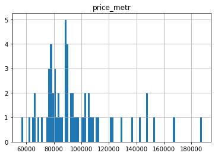
    


Выделите сегмент квартир в центре. Проанализируйте эту территорию и изучите следующие параметры: площадь, цена, число комнат, высота потолков. Также выделите факторы, которые влияют на стоимость квартиры (число комнат, этаж, удалённость от центра, дата размещения объявления). Сделайте выводы. Отличаются ли они от общих выводов по всей базе?

-----------------------------------------------------------------------------------------------------------------
Много квартир с растоянием от центра в 13 км. Это видно по количеству уникальных значений-вэлью каунтс и графику. 
Покупать квартиру лучше на удаление от цетра 13 км.-там больше кол-во предложений-поэтому и цена за 1 кв.м. ниже.-71920 средняя цена. Определили границу, где график сильно меняется, — это и есть центральная зона- до 13 км. удаленность от центра. ЕЕ и иследуем с помощью среза данных.


```python
df_zentra=df.query('rastoyanie_do_zentra>=0 and rastoyanie_do_zentra<=13')

print(df_zentra.head(15))

```

        total_images  last_price  total_area first_day_exposition  rooms  \
    2             10     5196000          56           2015-08-20      2   
    3              0    64900000         159           2015-07-24      3   
    4              2    10000000         100           2018-06-19      2   
    5             10     2890000          30           2018-09-10      1   
    7              5     7915000          71           2019-04-18      2   
    8             20     2900000          33           2018-05-23      1   
    10             5     5050000          39           2017-11-16      1   
    12            10     3890000          54           2016-06-30      2   
    16            11     6700000          82           2017-11-23      3   
    18             8     3250000          31           2017-01-27      1   
    19            16    14200000         121           2019-01-09      3   
    21            13     3200000          31           2018-03-14      1   
    22            20     5000000          58           2017-04-24      2   
    24             8     6500000          97           2015-10-31      2   
    26             6     4050000          60           2017-04-28      4   
    
        ceiling_height  floors_total  living_area  floor is_apartment  ...  \
    2         2.771499           5.0    34.300000      4               ...   
    3         2.771499          14.0     2.771499      9               ...   
    4         3.030000          14.0    32.000000     13               ...   
    5         2.771499          12.0    14.400000      5               ...   
    7         2.771499          24.0     2.771499     22               ...   
    8         2.771499          27.0    15.430000     26               ...   
    10        2.670000          12.0    20.300000      3               ...   
    12        2.771499           5.0    30.000000      5               ...   
    16        3.050000           5.0    55.600000      1               ...   
    18        2.500000           5.0    19.400000      2               ...   
    19        2.750000          16.0    76.000000      8               ...   
    21        2.771499           5.0    16.900000      2               ...   
    22        2.750000          25.0    30.000000     15               ...   
    24        2.771499           3.0    46.500000      1               ...   
    26        2.771499           5.0    43.000000      4               ...   
    
        ponds_nearest  days_exposition        day  year month  price_metr  \
    2           574.0            558.0   Thursday  2015     8       92785   
    3           234.0            424.0     Friday  2015     7      408176   
    4            48.0            121.0    Tuesday  2018     6      100000   
    5           502.0             55.0     Monday  2018     9       96333   
    7           502.0             95.0   Thursday  2019     4      111478   
    8           502.0            189.0  Wednesday  2018     5       87878   
    10          553.0            137.0   Thursday  2017    11      129487   
    12          502.0             90.0   Thursday  2016     6       72037   
    16          502.0            397.0   Thursday  2017    11       81707   
    18          502.0            168.0     Friday  2017     1      104838   
    19          502.0             97.0  Wednesday  2019     1      117355   
    21          502.0            310.0  Wednesday  2018     3      103225   
    22          502.0             60.0     Monday  2017     4       86206   
    24          124.0            265.0   Saturday  2015    10       67010   
    26           95.0            265.0     Friday  2017     4       67500   
    
        floor_category  zilaya_plosad  kuhna_plosad  rastoyanie_do_zentra  
    2           другой       0.612500      0.148214                    13  
    3           другой       0.017431      0.057233                     6  
    4           другой       0.320000      0.410000                     8  
    5           другой       0.480000      0.303333                    13  
    7           другой       0.039035      0.266197                    11  
    8           другой       0.467576      0.266970                    13  
    10          другой       0.520513      0.217949                    13  
    12          другой       0.555556      0.166667                    13  
    16          первый       0.678049      0.109756                    10  
    18          другой       0.625806      0.180645                    10  
    19          другой       0.628099      0.099174                    12  
    21          другой       0.545161      0.183871                     9  
    22          другой       0.517241      0.189655                    13  
    24          первый       0.479381      0.202062                     2  
    26          другой       0.716667      0.116667                    10  
    
    [15 rows x 30 columns]
    

 Нужно показать взаимосвязь отдаленности от центра-и показателями. Значит в индекс ставим "index='rastoyanie_do_zentra'"-отдаленность от центра и меняем только "values=". Потом мы объединим все таблицы пивот-по общему показателю-'rastoyanie_do_zentra'. А пока делаем таблицы пивот-с постоянным индекс-показателем-растояние до центра.
 


```python
df_plozad=df_zentra.pivot_table(index='rastoyanie_do_zentra', values='total_area')
print(df_plozad.head(15))
```

                          total_area
    rastoyanie_do_zentra            
    0                     111.941860
    1                     103.028926
    2                      98.667752
    3                      91.213208
    4                      95.786026
    5                      93.705195
    6                      82.687234
    7                      76.968059
    8                      67.357988
    9                      57.484848
    10                     55.404162
    11                     55.298233
    12                     54.731707
    13                     51.383037
    


```python
df_rooms=df_zentra.pivot_table(index='rastoyanie_do_zentra', values='rooms')
print(df_rooms.head(15))
```

                             rooms
    rastoyanie_do_zentra          
    0                     3.220930
    1                     3.239669
    2                     3.114007
    3                     3.016981
    4                     2.924672
    5                     2.740260
    6                     2.338298
    7                     2.422604
    8                     2.208580
    9                     2.028860
    10                    1.984666
    11                    2.018375
    12                    1.958471
    13                    1.877330
    


```python
df_height=df_zentra.pivot_table(index='rastoyanie_do_zentra', values='ceiling_height')
print(df_height.head(15))
```

                          ceiling_height
    rastoyanie_do_zentra                
    0                           3.099226
    1                           3.088539
    2                           3.112127
    3                           3.118213
    4                           2.997007
    5                           2.943652
    6                           2.895385
    7                           2.795065
    8                           3.029784
    9                           2.773943
    10                          2.737956
    11                          2.699070
    12                          2.699434
    13                          2.739256
    


```python
df_price=df_zentra.pivot_table(index='rastoyanie_do_zentra', values='price_metr')
print(df_price.head(15))
```

                             price_metr
    rastoyanie_do_zentra               
    0                     187716.674419
    1                     166805.838843
    2                     147016.651466
    3                     129782.769811
    4                     137581.566594
    5                     147330.223377
    6                     152774.836170
    7                     141884.238329
    8                     120897.902367
    9                     110531.927850
    10                    112145.720701
    11                    107349.250177
    12                    108820.206987
    13                     71920.313105
    

Теперь делаем сводную таблицу. Объединяем по 2 таблице-4 таблицы. Больше не дает метод. И потом полученные 2 таблицы объединяем в одну-df_full.
Создали матрицу рассеивания для этой таблицы методом pd.plotting.scatter_matrix(df) . Растояние до центра-зависит от цены-чем меньше от центра-тем дороже.


```python
df_full_rastoyanie1=df_price.join(df_height, on='rastoyanie_do_zentra')
df_full_rastoyanie2=df_rooms.join(df_plozad, on='rastoyanie_do_zentra')
df_full=df_full_rastoyanie1.join(df_full_rastoyanie2, on='rastoyanie_do_zentra')
print(df_full.head(15))


```

                             price_metr  ceiling_height     rooms  total_area
    rastoyanie_do_zentra                                                     
    0                     187716.674419        3.099226  3.220930  111.941860
    1                     166805.838843        3.088539  3.239669  103.028926
    2                     147016.651466        3.112127  3.114007   98.667752
    3                     129782.769811        3.118213  3.016981   91.213208
    4                     137581.566594        2.997007  2.924672   95.786026
    5                     147330.223377        2.943652  2.740260   93.705195
    6                     152774.836170        2.895385  2.338298   82.687234
    7                     141884.238329        2.795065  2.422604   76.968059
    8                     120897.902367        3.029784  2.208580   67.357988
    9                     110531.927850        2.773943  2.028860   57.484848
    10                    112145.720701        2.737956  1.984666   55.404162
    11                    107349.250177        2.699070  2.018375   55.298233
    12                    108820.206987        2.699434  1.958471   54.731707
    13                     71920.313105        2.739256  1.877330   51.383037
    

Цена-удаленность от центра-не понятен рост в промежуток с 4-7 кметров отдаленности от центра. Надо исследовать этот кусок.
Все остальное логично:
- с удалением от центра высота потолков падает.
- количество комнат уменьшается
- размер квартир уменьшается.
Не понятен рос цены на участке с 4-7 км. Может быть там есть пруд или парк поблизости-надо посмотреть.


```python
df_full.plot(kind='bar', y='price_metr', figsize=(10,5))
df_full.plot(kind='bar', y='ceiling_height', figsize=(10,5))
df_full.plot(kind='bar', y='rooms', figsize=(10,5))
df_full.plot(kind='bar', y='total_area', figsize=(10,5))

```


    <AxesSubplot:xlabel='rastoyanie_do_zentra'>


    
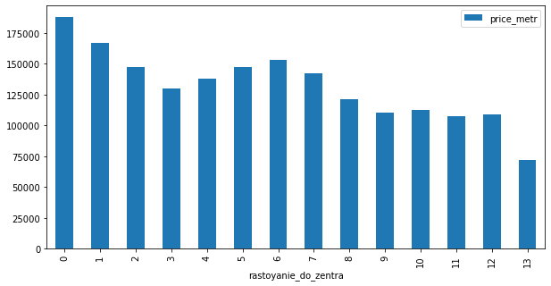
    


    
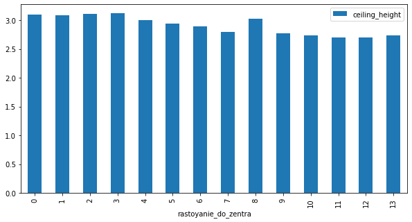
    


    
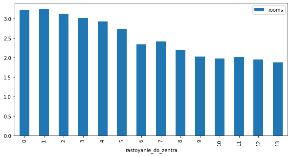
    


    
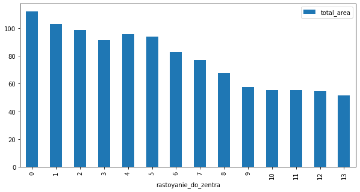
    


```python
pd.plotting.scatter_matrix(df_full, figsize=(9,9)) 
```


    array([[<AxesSubplot:xlabel='price_metr', ylabel='price_metr'>,
            <AxesSubplot:xlabel='ceiling_height', ylabel='price_metr'>,
            <AxesSubplot:xlabel='rooms', ylabel='price_metr'>,
            <AxesSubplot:xlabel='total_area', ylabel='price_metr'>],
           [<AxesSubplot:xlabel='price_metr', ylabel='ceiling_height'>,
            <AxesSubplot:xlabel='ceiling_height', ylabel='ceiling_height'>,
            <AxesSubplot:xlabel='rooms', ylabel='ceiling_height'>,
            <AxesSubplot:xlabel='total_area', ylabel='ceiling_height'>],
           [<AxesSubplot:xlabel='price_metr', ylabel='rooms'>,
            <AxesSubplot:xlabel='ceiling_height', ylabel='rooms'>,
            <AxesSubplot:xlabel='rooms', ylabel='rooms'>,
            <AxesSubplot:xlabel='total_area', ylabel='rooms'>],
           [<AxesSubplot:xlabel='price_metr', ylabel='total_area'>,
            <AxesSubplot:xlabel='ceiling_height', ylabel='total_area'>,
            <AxesSubplot:xlabel='rooms', ylabel='total_area'>,
            <AxesSubplot:xlabel='total_area', ylabel='total_area'>]],
          dtype=object)


    
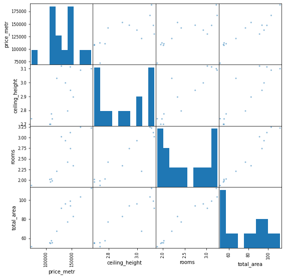
    


```python
df_zena_novaya=df.query('price_metr >=100000 and price_metr <=125000')
print(df_zena_novaya)

df_price_park=df_zena_novaya.pivot_table(index='price_metr', values='parks_around3000')
print(df_price_park.head())

df_price_ponds=df_zena_novaya.pivot_table(index='price_metr', values='ponds_around3000')
print(df_price_ponds.head())

df_price_ponds_nearest=df_zena_novaya.pivot_table(index='price_metr', values='ponds_nearest')
print(df_price_ponds_nearest.head())

df_price_parks_nearest=df_zena_novaya.pivot_table(index='price_metr', values='parks_nearest')
print(df_price_parks_nearest.head())


df_full_park=df_price_park.join(df_price_ponds, on='price_metr')

df_full_park2=df_price_ponds_nearest.join(df_price_parks_nearest, on='price_metr')

df_full3=df_full_park.join(df_full_park2, on='price_metr')
print(df_full3.head(15))


```

           total_images  last_price  total_area first_day_exposition  rooms  \
    0                20    13000000         108           2019-03-07      3   
    4                 2    10000000         100           2018-06-19      2   
    6                 6     3700000          37           2017-11-02      1   
    7                 5     7915000          71           2019-04-18      2   
    14                1     4400000          36           2016-06-23      1   
    ...             ...         ...         ...                  ...    ...   
    23674            10     5950000          56           2019-03-05      3   
    23681            13     5250000          43           2018-05-11      2   
    23686             8     3300000          31           2017-04-29      1   
    23689            13     3550000          35           2018-02-28      1   
    23690             3     5500000          52           2018-07-19      2   
    
           ceiling_height  floors_total  living_area  floor is_apartment  ...  \
    0            2.700000          16.0    51.000000      8               ...   
    4            3.030000          14.0    32.000000     13               ...   
    6            2.771499          26.0    10.600000      6               ...   
    7            2.771499          24.0     2.771499     22               ...   
    14           2.771499           6.0    17.000000      1               ...   
    ...               ...           ...          ...    ...          ...  ...   
    23674        2.771499           8.0    32.100000      3               ...   
    23681        2.500000           5.0    29.000000      2               ...   
    23686        2.550000           9.0    18.000000      6               ...   
    23689        2.860000          15.0    16.300000      4               ...   
    23690        2.771499           5.0    31.000000      2               ...   
    
           ponds_around3000  ponds_nearest  days_exposition        day  year  \
    0                   2.0          755.0             95.0   Thursday  2019   
    4                   1.0           48.0            121.0    Tuesday  2018   
    6                   0.0          502.0            155.0   Thursday  2017   
    7                   0.0          502.0             95.0   Thursday  2019   
    14                  1.0           96.0            203.0   Thursday  2016   
    ...                 ...            ...              ...        ...   ...   
    23674               2.0          303.0             95.0    Tuesday  2019   
    23681               2.0          660.0             80.0     Friday  2018   
    23686               1.0          317.0            193.0   Saturday  2017   
    23689               2.0          652.0             29.0  Wednesday  2018   
    23690               0.0          502.0             15.0   Thursday  2018   
    
           month  price_metr  floor_category  zilaya_plosad  kuhna_plosad  
    0          3      120370          другой       0.472222      0.231481  
    4          6      100000          другой       0.320000      0.410000  
    6         11      100000          другой       0.286486      0.389189  
    7          4      111478          другой       0.039035      0.266197  
    14         6      122222          первый       0.472222      0.222222  
    ...      ...         ...             ...            ...           ...  
    23674      3      106250          другой       0.573214      0.151786  
    23681      5      122093          другой       0.674419      0.139535  
    23686      4      106451          другой       0.580645      0.209677  
    23689      2      101428          другой       0.465714      0.260000  
    23690      7      105769          другой       0.596154      0.115385  
    
    [6372 rows x 29 columns]
                parks_around3000
    price_metr                  
    100000              0.595413
    100038              0.000000
    100078              0.000000
    100163              1.000000
    100169              0.000000
                ponds_around3000
    price_metr                  
    100000              0.660095
    100038              0.000000
    100078              0.000000
    100163              1.000000
    100169              1.000000
                ponds_nearest
    price_metr               
    100000         525.408989
    100038         502.000000
    100078         502.000000
    100163         575.000000
    100169         894.000000
                parks_nearest
    price_metr               
    100000         455.294382
    100038         455.000000
    100078         455.000000
    100163         579.000000
    100169         455.000000
                parks_around3000  ponds_around3000  ponds_nearest  parks_nearest
    price_metr                                                                  
    100000              0.595413          0.660095     525.408989     455.294382
    100038              0.000000          0.000000     502.000000     455.000000
    100078              0.000000          0.000000     502.000000     455.000000
    100163              1.000000          1.000000     575.000000     579.000000
    100169              0.000000          1.000000     894.000000     455.000000
    100227              0.000000          1.000000     330.000000     455.000000
    100230              1.000000          0.000000     502.000000     429.000000
    100243              0.000000          1.000000     178.000000     455.000000
    100256              1.000000          1.000000     738.000000     909.000000
    100263              0.000000          1.000000     776.000000     455.000000
    100312              0.611408          0.770255     502.000000     455.000000
    100323              0.000000          1.000000     756.000000     455.000000
    100370              0.000000          1.000000     733.000000     455.000000
    100425              2.000000          2.000000     326.000000     475.000000
    100446              1.000000          3.000000     142.000000     342.000000
    


```python

df_full3.plot(kind='bar', y='parks_around3000', figsize=(10,5))

df_full3.plot(kind='bar', y='ponds_around3000', figsize=(10,5))

df_full3.plot(kind='bar', y='ponds_nearest', figsize=(10,5))

df_full3.plot(kind='bar', y='parks_nearest', figsize=(10,5))
```


    <AxesSubplot:xlabel='price_metr'>


    
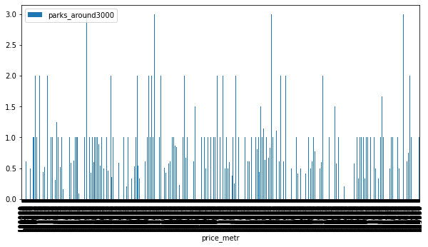
    


    
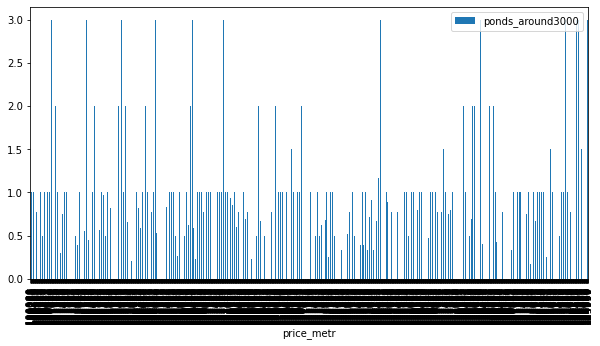
    


    
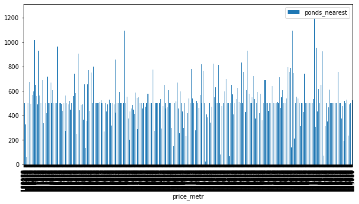
    


    
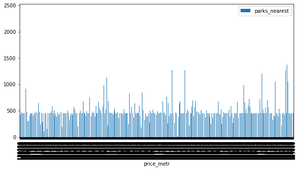
    


Вывод:
    Да цена растет в этом промежутке изза парков и прудов.

Вывод общий:
На цену на квартиры влияет и отдаленность от центра и высокие потолки и день недели продажи и год продажи и наличие парков и прудов.Влияет много факторов-в зависимости от того что наиболее значимо для покупателя. 
